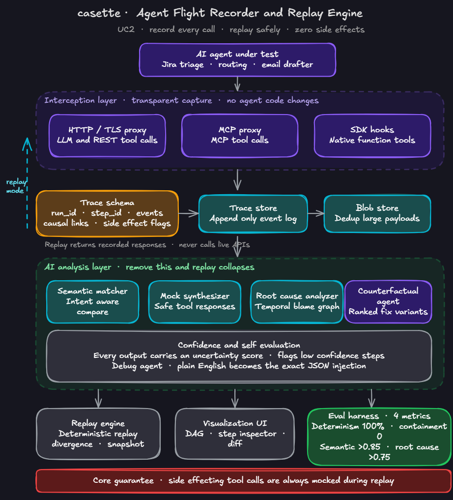
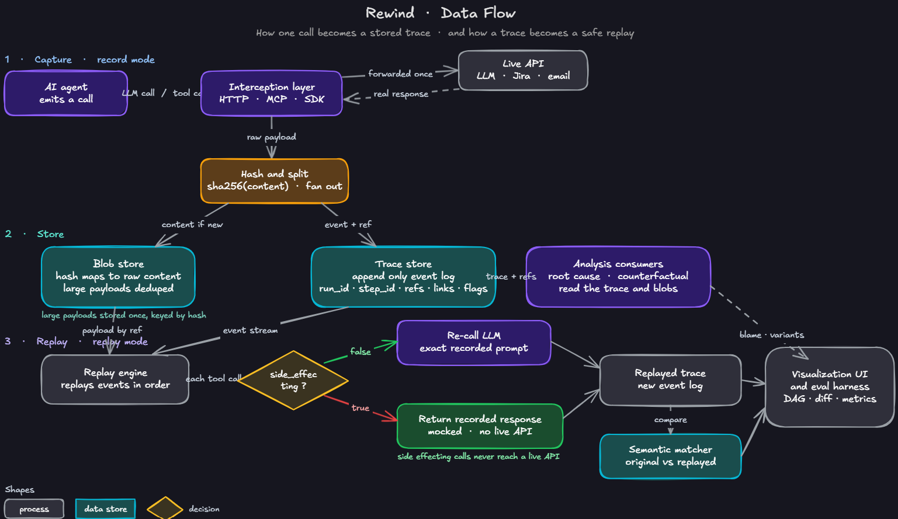
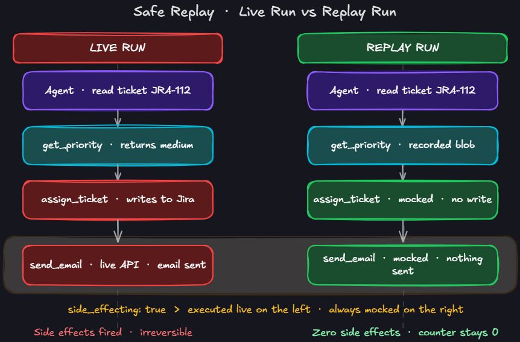
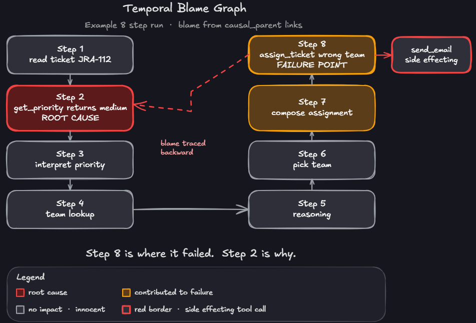
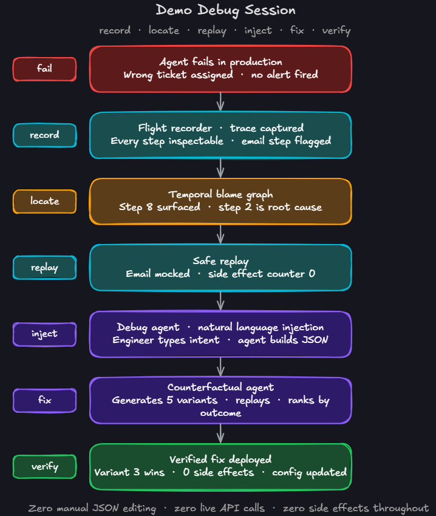

# Cassette: Agent Execution Tracer & Deterministic Replay Engine

> A flight recorder for AI agents: **record** any live run, **replay** it deterministically with zero live API calls, and let an AI debugging layer tell you **why it failed** and **which fix works**, without ever touching production.

**AINS Hackathon 2026 · AI for Enterprise Automation · Use Case 2**
Working prototype: record, deterministic replay, divergence, an AI blame + counterfactual debugging layer, and a live evaluation report, all behind a full UI.

## Quickstart

1. Clone the repo and cd into it.
2. Run `docker compose up` (no API key needed; the demo replays bundled recordings).
3. Open `http://localhost:5173` in your browser.

To record new traces, add a `GROQ_API_KEY` to `.env` (see `.env.example`).

---

## Import your own agent

Cassette records your own agent without any code change. You give it one input
(a git URL or a local path) and it does the rest: it clones the repo, runs it in
an isolated Docker container with the recording proxy and CA wired in
automatically, and captures the run. There is no manual proxy or certificate
setup.

**In the UI:** open **Connect agent**, use the **Import** panel, paste a git URL
(or a local path), optionally add a branch, a run command, and the agent's own
API key, then click **Import and record**. The run opens at
http://localhost:5173 when it finishes.

**Via the API:**

    curl -X POST http://localhost:8000/agents/import \
      -H 'Content-Type: application/json' \
      -d '{"source": "https://github.com/you/agent.git", "command": "python main.py"}'

What gets captured:

- **HTTP and MCP** tool/LLM calls: any language, transparently.
- **SDK (native in-process) tools:** Python agents, when the repo declares them
  in a `cassette.toml` tool manifest (or via the run entry point). The agent's
  source is never modified.

Docker is required (the agent runs in a container). Recordings live under the
shared store; set `CASSETTE_HOME` (and point `CASSETTE_DB_PATH` /
`CASSETTE_BLOB_DIR` at it) before `docker compose up` so the API/UI and the
import container read and write the same store.

> The previous `cassette` CLI (`run` / `enable` / `serve` / `trust`) has been
> removed; importing and recording is now API-driven (and surfaced in the UI).

---

## 1. The problem

When traditional software fails, you read the stack trace, reproduce the bug, and patch it. When an **AI agent** fails in production (it routes a ticket to the wrong team, calls a tool with a malformed argument, or quietly drafts an email it was never meant to send) almost none of that holds:

- **You cannot reproduce it.** The agent's behavior emerges from a sampled LLM, a live environment, and external tools, all of which shift between runs. Run it again an hour later and it reasons along a different path. The failure has dissolved.
- **You cannot safely re-run it.** The tools an agent calls are rarely read-only. They send messages, overwrite records, spend money. Debugging a faulty triage agent by re-running it risks firing the very side effect you were trying to understand.
- **You cannot recover what it knew.** The exact context the agent held at the decisive step vanishes the instant the run ends, and with it any hope of reconstructing what happened weeks later for an audit.

The engineer is left holding a flat log with no safe path forward. **What's missing is a recording layer that faithfully captures a live run in full (every model call, every tool exchange, every state change) paired with a replay mode that re-executes that run against the captured responses, deterministically, without ever reaching a live endpoint.** And because a trace no human can interpret is just a bigger log, that recorder needs an **intelligence layer** on top that reads the trajectory, pinpoints the fault, and proposes a fix.

---

## 2. The solution: Cassette

Cassette is a **transparent proxy** that sits between an unmodified agent and the outside world. No changes to the agent's logic: you point its LLM endpoint and tool traffic at Cassette, and it records everything. It runs in three modes, following a tape metaphor that explains the whole system in one breath:

| Mode | What it does |
|---|---|
| **Record** | Capture a live run to "tape": every LLM call (full prompt, context window, model, params, response) and every tool call (name, args, exact response payload, latency, status), linked into a parent→child trajectory tree. Large payloads are content-addressed (hashed) and stored once. |
| **Play** | Replay the run deterministically, served entirely from the tape. The proxy stops forwarding; when the agent makes a call, Cassette matches it to the recording and returns the recorded response. No LLM is sampled; **no tool fires**. Side-effecting calls are **always** mocked: the core safety guarantee. |
| **Record-over** | Edit a prompt, a system message, or a tool result mid-replay. That edit changes the call's identity, so the recorded response no longer matches, and Cassette **forks a new branch** from that step. The agent continues down a new trajectory, which the UI diffs against the original. The recorder becomes a what-if debugger. |

### Transparent interception: the primary technical challenge

No single interception point covers how modern agents call tools. Cassette intercepts at **three layers**, addressing a real protocol gap:

| Mode | Intercepts | How |
|---|---|---|
| **HTTP/TLS proxy** | LLM API calls + REST tool calls | Route agent traffic through a local proxy |
| **MCP proxy** | MCP-protocol tool calls (Jira, Confluence, …) | JSON-RPC envelope detection on the same proxy (no second interception point) |
| **SDK hooks** | Native function-calling tools wired via SDK | `@record_tool` decorator + in-process recording session |

**All three interception transports are implemented, and the agent is never modified.** HTTP
and MCP are captured transparently by an agent-agnostic mitmproxy forward proxy (per-process CA
trust, never the system store; secret redaction on capture). SDK (native function) tools have
no network seam, so the hook is installed **from outside the agent at runtime** —
install-from-outside instrumentation, the same approach as OpenTelemetry — wrapping the tool
callables before the run and restoring them after. An in-process recording session shares one
step-id sequence with the proxy, so a single run records all three transports into one trace
with the agent's source untouched.

```bash
python -m recorder.record --demo               # hermetic HTTP-only demo (subprocess proxy)
python -m recorder.record --demo --mcp         # MCP-over-HTTP demo
python -m recorder.record_session --demo       # all 3 transports (http+mcp+sdk) in one run
python -m recorder.record_session --demo --replay   # then replay from tape (zero live calls)
```

Replay hits zero live endpoints; side-effecting MCP and SDK tools are served from tape but
never executed (`live_executed: 0`, `divergences: 0`).

---

## 3. Core AI mechanism: *AI is the mechanism, not a feature*

Cassette's product is **not** "replay." Replay is conventional infrastructure (hashing, proxying, key-matching), and on its own it is just a tape recorder. Cassette's product is **automated failure diagnosis and repair for non-deterministic agents.** Replay is the safe substrate that makes that possible; the actual job, *"tell me why my agent failed, and which fix actually works"*, is performed entirely by AI.

**Remove the AI layer and the diagnostic verdict, the blame attribution, and the repair all collapse into a raw JSON dump.** Five AI components carry that load:

| Component | What it does | Why it requires AI |
|---|---|---|
| **Semantic matcher** | Decides whether a replayed run behaved "the same": *"routed to backend"* vs *"assigned to Backend Engineers."* Also scores replay fidelity / determinism. | Exact-string comparison fails on non-deterministic agents; equivalence is a semantic judgment. |
| **Root-cause analyzer (Temporal Blame Graph)** | Traces backward through causal links and assigns a blame score to every prior step (perturb a step's output, did the outcome change?). Verdict: *"Step 8 is where it failed. Step 2 is why."* | Attributing blame across an unstructured reasoning trajectory is irreducibly a reasoning task. |
| **Counterfactual repair agent** | Generates N reworded variants of the failing prompt, replays all in parallel (downstream mocked), ranks by outcome. *"Variant 3 succeeded: an explicit priority-enum constraint resolved the failure."* | Generating meaningful fix variants requires an LLM. |
| **Debug agent (NL to JSON injection)** | Engineer types *"at step 2, priority should have been high, not medium"*; the agent builds the exact, structurally valid injection and fires the replay. | Without the LLM, the engineer is back to hand-editing raw trace payloads. The clearest proof AI is load-bearing. |
| **Confidence / self-evaluation** | Every AI output carries an uncertainty score; low-confidence steps are flagged for human review. | Surfaces where the system is unsure instead of asserting blindly. |

### On non-determinism (the central technical concern)

Tool responses are fixed by the recorded tape, so the **environment** is deterministic on replay. The LLM itself may still vary, and rather than pretend otherwise, Cassette **quantifies** it: the semantic matcher scores behavioral equivalence, and a **determinism-rate** metric reports how often replays reproduce the original tool-call sequence.

---

## 4. Architecture



### Data flow: record path and safe-replay path



---

## 5. The debugging story

### Safe replay: live run vs. replay run

Side-effecting calls execute live on the left and are **always mocked** on the right. The side-effect counter stays at **0**.



### Temporal Blame Graph: *"Step 8 is where it failed. Step 2 is why."*

Instead of flagging the visibly failed step, blame is traced backward through causal links: red = root cause, orange = contributed, gray = innocent.



### End-to-end demo session: record, locate, replay, inject, fix, verify

The whole loop (detect, locate, fix, verify) completes without touching production once.



---

## 6. Mapping to the brief (Use Case 2)

| Capability expected | How Cassette delivers it |
|---|---|
| **Trajectory recording** | Proxy logs every LLM call, prompt, context variable, and tool response as a linked span tree. |
| **Deterministic replay** | Play mode re-executes step-by-step, returning recorded responses. Zero live endpoints hit. |
| **State snapshotting** | Agent context window serialized at each step; any point resumable and inspectable. |
| **Divergence support** | Record-over forks the trajectory when a developer edits a prompt or tool result mid-replay. |

### Target users

- **AI / agent engineers** (primary): debugging non-deterministic failures, today armed with only flat logs.
- **Platform & MLOps teams**: observability, reproducibility, regression-safety across a fleet of agents.
- **QA & red-teamers**: replaying and mutating adversarial runs safely, with no live side effects.
- **Compliance & risk officers**: a frozen, auditable record of exactly what an agent saw and did.

---

## 7. Evaluation plan

| Metric | Definition | Target |
|---|---|---|
| Determinism rate | % of replays that reproduce the original tool-call sequence | 100% |
| Side-effect containment | Count of side-effecting tool calls executed during replay | 0 (always) |
| Semantic-match P/R | Precision/recall of the semantic matcher vs. human-labeled equivalences | > 0.85 |
| Root-cause accuracy | % of injected failures where the blame graph identifies the correct root cause | > 0.75 |

Run against a synthetic test set of injected failures (see [`eval/`](eval/)).

---

## 8. Technical direction

| Layer | Choice | Why |
|---|---|---|
| Language | Python | Native language of the agent ecosystem. |
| Interception | Framework-agnostic HTTP proxy + native MCP proxy + SDK hooks | Keeps the agent unmodified across LangChain / LangGraph, raw SDK, and MCP-based agents. |
| Trace store | Structured spans (SQLite + JSON), OpenTelemetry GenAI-style conventions | Queryable; content-addressed blob store dedupes large payloads so storage stays linear. |
| AI layer | Groq (open-source models, OpenAI-compatible API) | Powers the matcher, root-cause, counterfactual, and debug agents. |
| Interface | Web app | Trajectory tree, step inspector, divergence diff. |

See [`docs/architecture.md`](docs/architecture.md) and the trace contract in [`docs/trace_schema.json`](docs/trace_schema.json).

---

## 9. Repository structure

```
AINS_HACK/
├── README.md                  ← this file
├── requirements.txt
├── docs/
│   ├── images/                ← architecture & flow diagrams
│   ├── architecture.md        ← component-by-component breakdown
│   ├── trace_schema.json      ← the trace contract (shared by all modules)
│   └── demo_scenario.md       ← the 5-minute end-to-end demo script
├── agent/                     ← toy Jira-triage agent under test
├── recorder/                  ← interception layer (HTTP / MCP / SDK)
├── trace_store/               ← append-only event log + content-addressed blob store
├── replay_engine/             ← deterministic replay, divergence, snapshot/resume
├── ai_agents/                 ← semantic matcher, mock synth, root-cause, counterfactual, debug agent
├── visualizer/                ← React UI: trace graph, step inspector, divergence diff
└── eval/                      ← evaluation harness + synthetic test set
```

Each module has its own `README.md` describing its responsibility and interface.

---

## 10. Status

Working end to end. Record → store → **deterministic replay** over **all three transports**
(HTTP, MCP, SDK), captured into one schema-valid trace and replayed with zero live endpoints
and side-effect containment (`side_effect_count: 0`). On top of that substrate the full system
is live: the **transparent proxy** + a hosted "Connect agent" quick test, the **Temporal Blame
Graph**, the **AI debug agent** (plain-English fix → fork → pass/fail verdict), **counterfactual**
ranking by real replay outcomes, a **failure-memory** library that learns from resolved failures,
and a **live evaluation report** computed from the recorded runs — all behind a React UI.

---

## 11. Setup

**Demo (no key needed — replays bundled recordings):**

```bash
docker compose up --build
# open http://localhost:5173
```

**Record live runs:** add `GROQ_API_KEY` to `.env` (see `.env.example`), then use
Connect agent → Quick test (Groq recommended) in the UI, or Connect agent →
Import to bring in your own agent by git URL or local path.

**Run the test suite:**

```bash
python -m venv .venv
source .venv/bin/activate      # Windows: .venv\Scripts\activate
pip install -r requirements.txt
python -m pytest -q --import-mode=importlib
```

---

*AINS Hackathon 2026 · AI for Enterprise Automation · Use Case 2.*
